## When to use this skill

- Creating or editing UML diagrams in Mermaid.js syntax within markdown files
- Visualizing TypeScript class hierarchies, interfaces, and type relationships
- Documenting hexagonal/clean architecture with ports, adapters, graph, and runtime layers
- Creating sequence diagrams showing request flows through the application
- Drawing component diagrams showing package dependencies in a monorepo
- Creating state machine diagrams for stateful logic
- Documenting entity-relationship models for data structures
- Creating C4 architecture diagrams (Context, Container, Component, Code)
- Adding visual documentation to specification files in `spec/` directories
- Creating flowcharts for business logic, decision trees, or algorithms
- Diagramming dependency injection wiring and service graphs
- Visualizing event-driven architectures, pub/sub flows, or message sequences
- Documenting API contracts and interaction patterns between systems
- Planning and communicating architectural decisions visually
- Any task where "a picture is worth a thousand words" applies to code architecture

---

# UML Diagrams with Mermaid.js

Generate clear, accurate, and maintainable UML diagrams using Mermaid.js syntax. Mermaid is the preferred diagramming tool because it is text-based (version control friendly), renders natively in GitHub/GitLab markdown, and can be generated programmatically by AI.

## Diagram Type Selection Guide

Choose the right diagram type based on what you need to communicate:

### Structure Diagrams (What the system IS)

| Diagram Type | Use When | Mermaid Type |
|-------------|----------|--------------|
| **Class Diagram** | Showing types, interfaces, inheritance, composition | `classDiagram` |
| **Component Diagram** | Showing packages, modules, and their dependencies | `flowchart` or `C4Component` |
| **Package Diagram** | Showing monorepo structure, package relationships | `flowchart` |
| **Object Diagram** | Showing runtime instances and their state | `classDiagram` with notes |
| **ER Diagram** | Showing data models, entities, and relationships | `erDiagram` |

### Behavior Diagrams (What the system DOES)

| Diagram Type | Use When | Mermaid Type |
|-------------|----------|--------------|
| **Sequence Diagram** | Showing message flow between objects over time | `sequenceDiagram` |
| **State Diagram** | Showing lifecycle states and transitions | `stateDiagram-v2` |
| **Activity/Flowchart** | Showing workflows, algorithms, decision logic | `flowchart` |
| **Use Case Diagram** | Showing user interactions with the system | `flowchart` with actors |

### Architecture Diagrams (System at Scale)

| Diagram Type | Use When | Mermaid Type |
|-------------|----------|--------------|
| **C4 Context** | Showing system in its environment | `C4Context` |
| **C4 Container** | Showing high-level technical building blocks | `C4Container` |
| **C4 Component** | Showing internal components of a container | `C4Component` |
| **Deployment** | Showing infrastructure and deployment topology | `flowchart` |

---

## Mermaid Syntax Reference

### Class Diagrams

Use for TypeScript interfaces, types, classes, and their relationships.

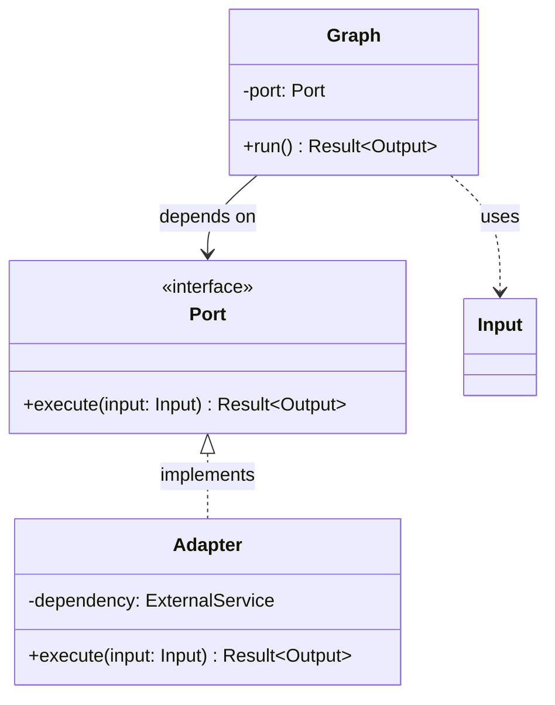

**Key syntax:**

```
%% Visibility markers
+ public
- private
# protected
~ package/internal

%% Relationships (from most to least coupling)
A <|-- B        Inheritance (B extends A)
A <|.. B        Realization (B implements A)
A *-- B         Composition (A owns B, B dies with A)
A o-- B         Aggregation (A has B, B can exist alone)
A --> B         Association (A uses B)
A ..> B         Dependency (A temporarily uses B)

%% Cardinality
A "1" --> "*" B         One to many
A "0..1" --> "1..*" B   Optional to one-or-more

%% Annotations
class MyInterface {
    <<interface>>
}
class MyEnum {
    <<enumeration>>
    VALUE_A
    VALUE_B
}
class MyAbstract {
    <<abstract>>
}
class MyService {
    <<service>>
}

%% Generics
class Container~T~ {
    +get() T
    +set(value: T) void
}

%% Notes
note for ClassName "Important detail"
```

### Sequence Diagrams

Use for showing interactions between components over time.

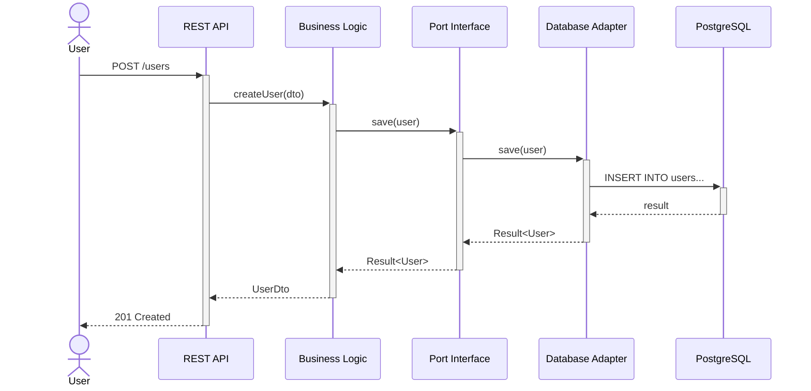

**Key syntax:**

```
%% Message types
A->>B       Synchronous request (solid arrow)
A-->>B      Synchronous response (dotted arrow)
A-)B        Async message (open arrow)
A--)B       Async response (dotted open arrow)
A-xB        Lost message (cross)
A<<->>B     Bidirectional

%% Activation (shows processing time)
A->>+B: request    %% activate B
B-->>-A: response  %% deactivate B

%% Control flow
alt condition
    A->>B: path 1
else other condition
    A->>C: path 2
end

opt optional
    A->>B: maybe
end

loop every 5 seconds
    A->>B: poll
end

par parallel
    A->>B: task 1
and
    A->>C: task 2
end

critical must succeed
    A->>B: important
option failure
    A->>C: fallback
end

break when error
    A->>B: abort
end

%% Notes
Note right of A: explanation
Note over A,B: spans both
```

### State Diagrams

Use for showing lifecycle states and transitions.

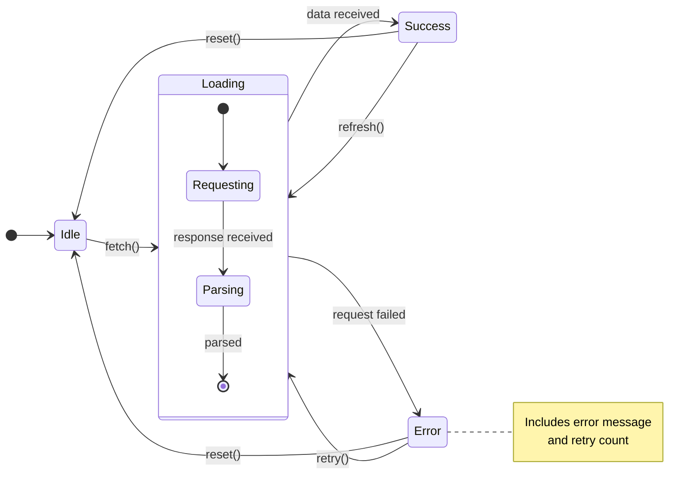

**Key syntax:**

```
[*] --> State          Initial transition
State --> [*]          Final transition
State1 --> State2 : event   Transition with label

state "Display Name" as s1    Aliased state
state CompositeState {        Nested states
    [*] --> Inner
    Inner --> [*]
}

state fork_state <<fork>>    Fork pseudo-state
state join_state <<join>>    Join pseudo-state
state choice <<choice>>      Choice pseudo-state

note right of State          Notes
    Explanation text
end note
```

### Flowcharts

Use for workflows, algorithms, decision trees, and component diagrams.

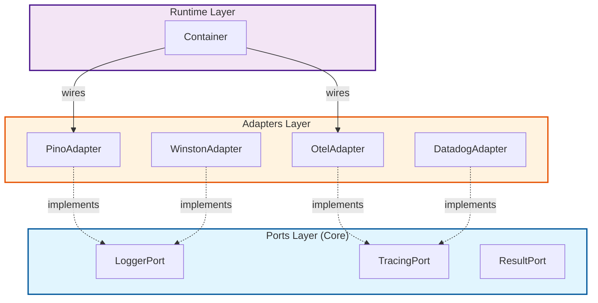

**Key syntax:**

```
%% Node shapes
A[Rectangle]
B(Rounded)
C([Stadium])
D[[Subroutine]]
E[(Database)]
F((Circle))
G{Diamond/Decision}
H{{Hexagon}}
I[/Parallelogram/]
J[\Trapezoid\]

%% Directions
flowchart TB    %% Top to Bottom
flowchart BT    %% Bottom to Top
flowchart LR    %% Left to Right
flowchart RL    %% Right to Left

%% Link styles
A --> B         Solid arrow
A --- B         Solid line
A -.-> B        Dotted arrow
A ==> B         Thick arrow
A -- text --> B Labeled link
A -->|text| B   Labeled link (alt)

%% Subgraphs
subgraph title
    direction TB
    A --> B
end

%% Styling
style A fill:#f9f,stroke:#333,stroke-width:2px
classDef port fill:#e1f5fe,stroke:#01579b
class A,B port
```

### Entity-Relationship Diagrams

Use for data models and entity relationships.

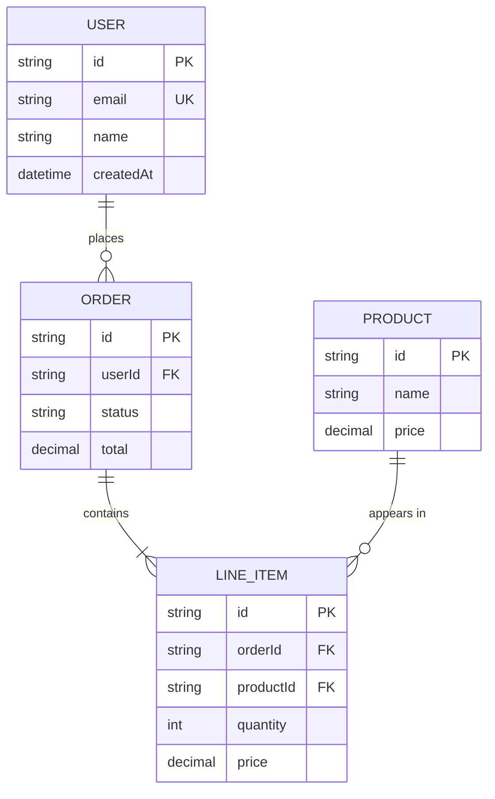

**Key syntax:**

```
%% Relationships
||--||    Exactly one to exactly one
||--o{    Exactly one to zero or more
||--|{    Exactly one to one or more
o{--o{    Zero or more to zero or more

%% Attribute markers
PK    Primary Key
FK    Foreign Key
UK    Unique Key
```

### C4 Architecture Diagrams

Use for multi-level architecture documentation.

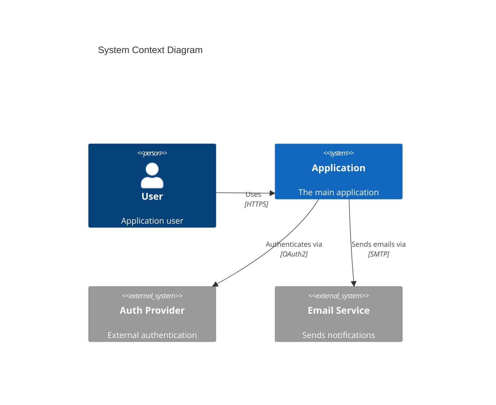

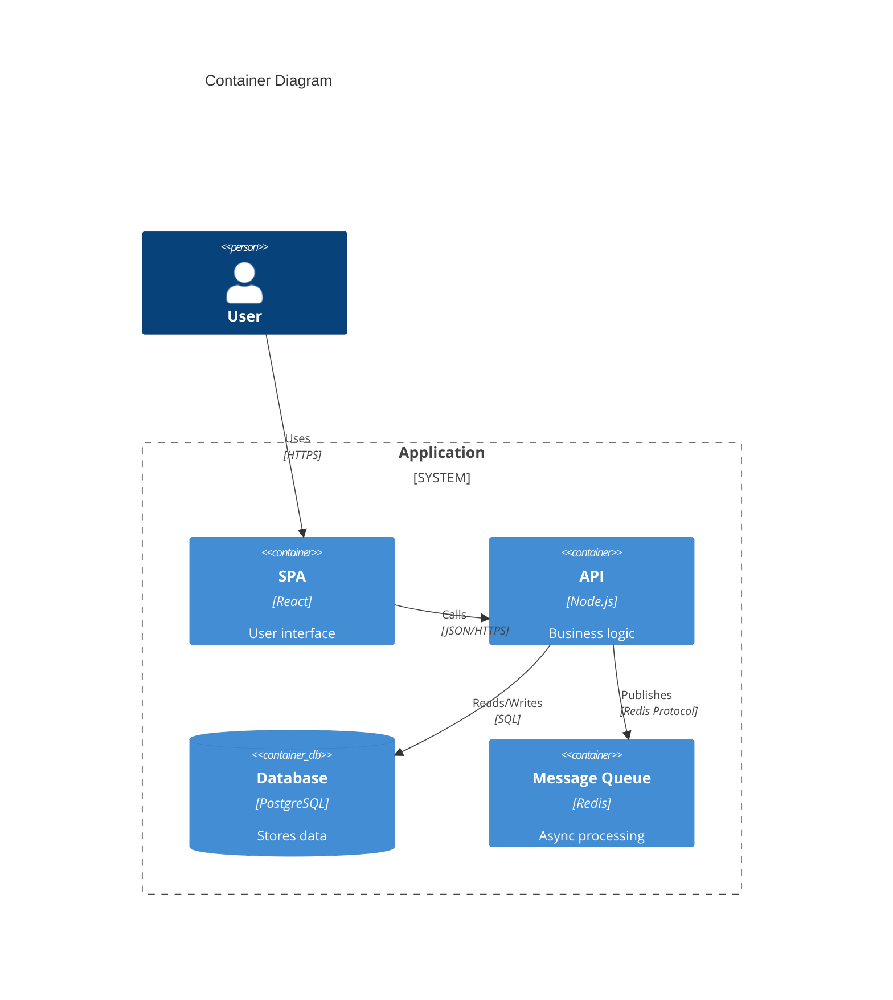

---

## Best Practices

### 1. Choose the Right Level of Detail

- **Too little detail**: Diagram doesn't communicate anything useful
- **Too much detail**: Diagram becomes unreadable noise
- **Right level**: Shows the key relationships and decisions that matter

**Rule of thumb**: If a diagram has more than 15-20 elements, split it into multiple diagrams at different levels of abstraction.

### 2. Use Consistent Naming

- Match names in diagrams to actual code identifiers
- Use the same terminology as the codebase (Port, Adapter, Graph, Runtime)
- Don't abbreviate unless the abbreviation is universally understood

### 3. Show Direction of Dependencies

- Always make dependency direction explicit with arrows
- In hexagonal architecture, arrows should point INWARD (toward the domain)
- Use different arrow styles to distinguish relationship types

### 4. Color Code Architecture Layers

Use consistent colors across all diagrams:

| Layer | Color | Hex |
|-------|-------|-----|
| Ports/Domain | Light Blue | `#e1f5fe` |
| Adapters/Infrastructure | Light Orange | `#fff3e0` |
| Graph/Application | Light Purple | `#f3e5f5` |
| Runtime/Composition | Light Green | `#e8f5e8` |
| External Systems | Light Red | `#fce4ec` |

### 5. Label Relationships

Always label relationships with their semantic meaning:
- `implements` not just an arrow
- `depends on` to show dependency direction
- `creates` to show lifecycle ownership
- `calls` to show runtime interaction

### 6. Keep Diagrams in Sync with Code

- Store diagrams in markdown files next to the code they document
- Update diagrams when the code changes
- Use diagrams in specification files (`spec/`) as the source of truth
- Reference specific file paths in diagram notes when helpful

### 7. One Concept Per Diagram

Each diagram should answer ONE question:
- "What are the types and their relationships?" -> Class diagram
- "How does a request flow through the system?" -> Sequence diagram
- "What states can this entity be in?" -> State diagram
- "What packages exist and how do they depend on each other?" -> Component diagram

---

## Patterns for This Codebase

### Hexagonal Architecture Layers

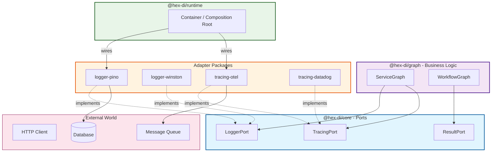

### Port-Adapter Relationship

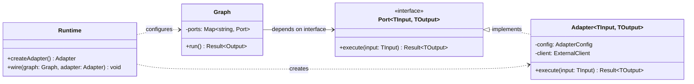

### Request Flow Through Layers

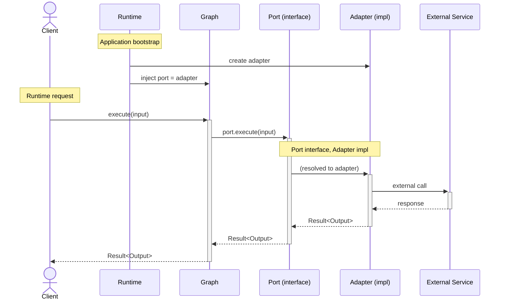

---

## Common Diagram Templates

### Template: Package Dependency Map

```mermaid
flowchart LR
    subgraph Core
        core["@hex-di/core"]
        result["@hex-di/result"]
    end

    subgraph Packages
        graph["@hex-di/graph"]
        runtime["@hex-di/runtime"]
        logger["@hex-di/logger"]
        tracing["@hex-di/tracing"]
    end

    subgraph Adapters
        pino["logger-pino"]
        winston["logger-winston"]
        otel["tracing-otel"]
    end

    graph --> core
    graph --> result
    runtime --> core
    runtime --> graph
    logger --> core
    tracing --> core
    pino --> logger
    winston --> logger
    otel --> tracing

    style Core fill:#e1f5fe,stroke:#01579b
    style Packages fill:#f3e5f5,stroke:#4a148c
    style Adapters fill:#fff3e0,stroke:#e65100
```

### Template: Error/Result Flow

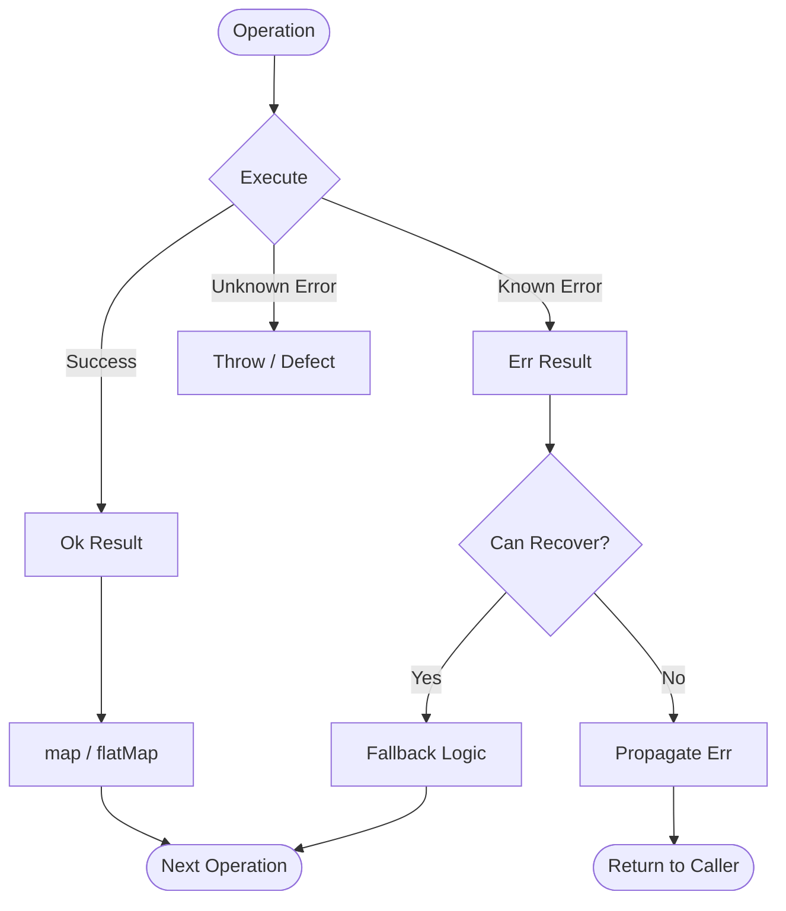

### Template: State Machine

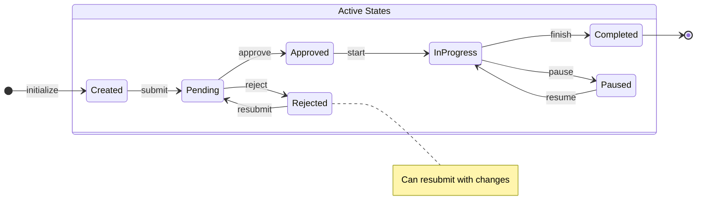

---

## Anti-Patterns to Avoid

1. **Diagram without a purpose**: Every diagram must answer a specific question. If you can't state what question it answers, don't create it.

2. **Showing everything**: A diagram that shows every class, every method, every relationship is useless. Show what matters for the reader's question.

3. **Inconsistent with code**: A diagram that doesn't match the actual code is worse than no diagram. Keep them synchronized.

4. **Wrong diagram type**: Don't use a class diagram to show runtime behavior. Don't use a sequence diagram to show type hierarchy.

5. **No legend or context**: If using custom colors, shapes, or conventions, include a brief legend or note explaining them.

6. **Stale diagrams**: If you update the code, update the diagram. A stale diagram actively misleads.

---

## Generating Diagrams from Code

When asked to create a diagram for existing code:

1. **Read the relevant source files** first to understand the actual structure
2. **Identify the key abstractions** - not every type needs to be in the diagram
3. **Map relationships accurately** - check actual imports and dependencies
4. **Use correct Mermaid syntax** - validate the diagram renders correctly
5. **Place the diagram** in the appropriate markdown file (README, spec, or dedicated docs)

When creating diagrams for planned/new code:

1. **Start with the diagram** as a design tool
2. **Use it to communicate intent** before writing code
3. **Update it** as the implementation evolves
4. **Keep it** as documentation after implementation
