# @hex-di/result-react — Overview

## Package Metadata

| Field         | Value                                                                       |
| ------------- | --------------------------------------------------------------------------- |
| Name          | `@hex-di/result-react`                                                      |
| Version       | `0.1.0`                                                                     |
| License       | MIT                                                                         |
| Repository    | `https://github.com/hex-di/result.git` (directory: `packages/result-react`) |
| Module format | ESM only                                                                    |
| Side effects  | None (`"sideEffects": false`)                                               |
| React         | `>= 18.0.0`                                                                |
| TypeScript    | `>= 5.0` (optional peer dependency)                                        |

## Mission

Provide idiomatic React bindings for `@hex-di/result` that bridge `Result<T, E>` and `ResultAsync<T, E>` into the React component lifecycle — hooks, pattern matching components, and framework adapters — without compromising the core library's "errors as values" philosophy.

## Design Philosophy

1. **Errors remain values** — The React layer renders `Ok` and `Err` branches via pattern matching. It never promotes throwing as a primary pattern. This aligns with the core library's philosophy. See [ADR-R001](decisions/R001-no-error-boundary.md).
2. **Minimal surface** — Only add what React genuinely needs. The core `.match()` method already works inline in JSX; components and hooks exist for cases where React lifecycle integration is required.
3. **Type-safe** — Full generic inference across all components and hooks. Render-prop components enforce exhaustiveness at the type level. See [type-system/inference.md](type-system/inference.md).
4. **Consistent with core** — Follows the core library's naming conventions (`from*` constructors, `match` terminology), subpath export pattern, and dual-API philosophy where applicable. See [ADR-R003](decisions/R003-naming-conventions.md).
5. **Tree-shakeable** — Named exports only. No default exports, no barrel re-exports of core types.
6. **React-idiomatic** — Hooks follow React naming conventions (`use*`). Components use render-prop patterns. All callbacks from hooks are referentially stable.
7. **Framework-agnostic adapters** — Integration with TanStack Query, SWR, and server actions via optional adapter subpath. The core hooks do not compete with data fetching libraries. See [ADR-R004](decisions/R004-adapter-strategy.md).

## Runtime Requirements

- **React** `>= 18.0.0` (peer dependency)
- **@hex-di/result** `>= 1.0.0` (peer dependency)
- **TypeScript** `>= 5.0` (optional — works in plain JavaScript)
- **Build**: `tsc` with `tsconfig.build.json`
- **Test**: Vitest (runtime), Vitest typecheck (type-level), React Testing Library

### Optional Peer Dependencies

| Package | Required For | Subpath |
| ------- | ------------ | ------- |
| `@tanstack/react-query` `>= 5.0` | `toQueryFn`, `toQueryOptions`, `toMutationFn`, `toMutationOptions` | `@hex-di/result-react/adapters` |
| `swr` `>= 2.0` | `toSwrFetcher` | `@hex-di/result-react/adapters` |
| `@storybook/react` `>= 7.0` | `ResultDecorator` | `@hex-di/result-react/testing` |

These are only needed if you use the corresponding exports. The main entry point has no optional peer dependencies.

### React Version Compatibility

| Export | React 18 | React 19 | Notes |
| ------ | :------: | :------: | ----- |
| `Match` | Yes | Yes | |
| `useResult` | Yes | Yes | |
| `useResultAsync` | Yes | Yes | |
| `useResultAction` | Yes | Yes | |
| `useResultSuspense` | Yes | Yes | Uses `use()` on React 19, throw-promise on React 18 |
| `createResultResource` | Yes | Yes | |
| `useSafeTry` | Yes | Yes | |
| `useOptimisticResult` | No | Yes | Throws at import time on React 18 |
| `useResultTransition` | No | Yes | Throws at import time on React 18 |
| `fromAction` | Yes | Yes | |
| All `/adapters` exports | Yes | Yes | |
| All `/server` exports | Yes | Yes | No React runtime dependency |
| All `/testing` exports | Yes | Yes | |

## Public API Surface

### Components

| Export          | Kind      | Source              | Subpath                |
| --------------- | --------- | ------------------- | ---------------------- |
| `Match`         | Component | `components/match.tsx` | `@hex-di/result-react` |

### Async Hooks

| Export              | Kind     | Source                             | Subpath                |
| ------------------- | -------- | ---------------------------------- | ---------------------- |
| `useResultAsync`    | Hook     | `hooks/use-result-async.ts`        | `@hex-di/result-react` |
| `useResultAction`   | Hook     | `hooks/use-result-action.ts`       | `@hex-di/result-react` |
| `useResultSuspense` | Hook     | `hooks/use-result-suspense.ts`     | `@hex-di/result-react` |
| `createResultResource` | Function | `hooks/create-result-resource.ts` | `@hex-di/result-react` |

Note: `createResultResource` is a factory function (not a hook) called outside the component tree. It is grouped here because its purpose is async data loading for Suspense.

### State & Composition Hooks

| Export                | Kind | Source                             | Subpath                |
| --------------------- | ---- | ---------------------------------- | ---------------------- |
| `useResult`           | Hook | `hooks/use-result.ts`              | `@hex-di/result-react` |
| `useOptimisticResult` | Hook | `hooks/use-optimistic-result.ts`   | `@hex-di/result-react` |
| `useSafeTry`          | Hook | `hooks/use-safe-try.ts`            | `@hex-di/result-react` |
| `useResultTransition` | Hook | `hooks/use-result-transition.ts`   | `@hex-di/result-react` |

### Utilities

| Export          | Kind     | Source                    | Subpath                       |
| --------------- | -------- | ------------------------- | ----------------------------- |
| `fromAction`    | Function | `utilities/from-action.ts` | `@hex-di/result-react`       |

### Adapters

| Export               | Kind     | Source                           | Subpath                              |
| -------------------- | -------- | -------------------------------- | ------------------------------------ |
| `toQueryFn`          | Function | `adapters/tanstack-query.ts`     | `@hex-di/result-react/adapters`     |
| `toQueryOptions`     | Function | `adapters/tanstack-query.ts`     | `@hex-di/result-react/adapters`     |
| `toMutationFn`       | Function | `adapters/tanstack-query.ts`     | `@hex-di/result-react/adapters`     |
| `toMutationOptions`  | Function | `adapters/tanstack-query.ts`     | `@hex-di/result-react/adapters`     |
| `toSwrFetcher`       | Function | `adapters/swr.ts`                | `@hex-di/result-react/adapters`     |

### Testing Utilities

| Export                      | Kind      | Source                         | Subpath                             |
| --------------------------- | --------- | ------------------------------ | ----------------------------------- |
| `setupResultReactMatchers`  | Function  | `testing/matchers.ts`          | `@hex-di/result-react/testing`     |
| `renderWithResult`          | Function  | `testing/render-helpers.ts`    | `@hex-di/result-react/testing`     |
| `createResultFixture`       | Function  | `testing/fixtures.ts`          | `@hex-di/result-react/testing`     |
| `mockResultAsync`           | Function  | `testing/mocks.ts`             | `@hex-di/result-react/testing`     |
| `ResultDecorator`           | Function  | `testing/storybook.ts`         | `@hex-di/result-react/testing`     |

### Server Utilities

| Export               | Kind     | Source                        | Subpath                             |
| -------------------- | -------- | ----------------------------- | ----------------------------------- |
| `matchResult`        | Function | `server/match-result.ts`      | `@hex-di/result-react/server`      |
| `matchResultAsync`   | Function | `server/match-result-async.ts` | `@hex-di/result-react/server`     |
| `matchOption`        | Function | `server/match-option.ts`      | `@hex-di/result-react/server`      |
| `resultAction`       | Function | `server/result-action.ts`     | `@hex-di/result-react/server`      |

## Subpath Exports

| Subpath                             | Contents                                        | Notes                                     |
| ----------------------------------- | ----------------------------------------------- | ----------------------------------------- |
| `@hex-di/result-react`             | Components, hooks, utilities                    | Default entry point                       |
| `@hex-di/result-react/adapters`    | TanStack Query, SWR adapters                    | Framework integration layer               |
| `@hex-di/result-react/server`      | RSC-safe match functions, server action helpers  | No `"use client"` — works in RSC          |
| `@hex-di/result-react/testing`     | Vitest matchers, render helpers, fixtures, mocks | Test-time utilities                       |
| `@hex-di/result-react/internal/*`  | **Blocked** (`null`)                            | Prevents importing internal modules       |

See [ADR-R002](decisions/R002-subpath-exports.md).

## Module Dependency Graph

```mermaid
graph TD
    index["index.ts (public API)"]

    match["components/match.tsx"]
    useResult["hooks/use-result.ts"]
    useResultAsync["hooks/use-result-async.ts"]
    useResultAction["hooks/use-result-action.ts"]
    useResultSuspense["hooks/use-result-suspense.ts"]
    createResource["hooks/create-result-resource.ts"]
    useOptimistic["hooks/use-optimistic-result.ts"]
    useSafeTry["hooks/use-safe-try.ts"]
    useResultTransition["hooks/use-result-transition.ts"]
    fromAction["utilities/from-action.ts"]

    adapters["adapters/index.ts"]
    tq["adapters/tanstack-query.ts"]
    swr["adapters/swr.ts"]

    server["server/index.ts"]
    matchResult["server/match-result.ts"]
    matchResultAsync["server/match-result-async.ts"]
    matchOption["server/match-option.ts"]
    resultAction["server/result-action.ts"]

    testing["testing/index.ts"]
    matchers["testing/matchers.ts"]
    helpers["testing/render-helpers.ts"]
    fixtures["testing/fixtures.ts"]
    mocks["testing/mocks.ts"]
    storybook["testing/storybook.ts"]

    core["@hex-di/result (peer)"]
    react["react (peer)"]

    index --> match
    index --> useResult
    index --> useResultAsync
    index --> useResultAction
    index --> useResultSuspense
    index --> createResource
    index --> useOptimistic
    index --> useSafeTry
    index --> useResultTransition
    index --> fromAction

    adapters --> tq
    adapters --> swr

    server --> matchResult
    server --> matchResultAsync
    server --> matchOption
    server --> resultAction

    testing --> matchers
    testing --> helpers
    testing --> fixtures
    testing --> mocks
    testing --> storybook

    match --> core
    match --> react
    useResult --> core
    useResult --> react
    useResultAsync --> core
    useResultAsync --> react
    useResultAction --> core
    useResultAction --> react
    useResultSuspense --> core
    useResultSuspense --> react
    createResource --> core
    useOptimistic --> core
    useOptimistic --> react
    useSafeTry --> core
    useSafeTry --> react
    useResultTransition --> core
    useResultTransition --> react
    fromAction --> core

    tq --> core
    swr --> core

    matchResult --> core
    matchResultAsync --> core
    matchOption --> core
    resultAction --> core

    helpers --> react
    fixtures --> core
    mocks --> core
```

## Source File Map

| File                                | Responsibility                                                       |
| ----------------------------------- | -------------------------------------------------------------------- |
| `components/match.tsx`              | `Match` render-prop component for Result pattern matching            |
| `hooks/use-result.ts`              | `useResult` — stateful Result with stable action callbacks           |
| `hooks/use-result-async.ts`        | `useResultAsync` — eager async with abort, generation tracking, retry |
| `hooks/use-result-action.ts`       | `useResultAction` — lazy async triggered by `execute()`              |
| `hooks/use-result-suspense.ts`     | `useResultSuspense` — Suspense integration via React 19 `use()`     |
| `hooks/create-result-resource.ts`  | `createResultResource` — Suspense resource for render-as-you-fetch   |
| `hooks/use-optimistic-result.ts`   | `useOptimisticResult` — bridges React 19 `useOptimistic`            |
| `hooks/use-safe-try.ts`            | `useSafeTry` — generator-based sequential async composition          |
| `hooks/use-result-transition.ts`   | `useResultTransition` — bridges React 19 `useTransition`            |
| `utilities/from-action.ts`         | `fromAction` — wraps server actions to return ResultAsync            |
| `adapters/tanstack-query.ts`       | `toQueryFn`, `toQueryOptions`, `toMutationFn`, `toMutationOptions`   |
| `adapters/swr.ts`                  | `toSwrFetcher` — SWR adapter                                        |
| `server/match-result.ts`           | `matchResult` — pure Result pattern match for RSC                    |
| `server/match-result-async.ts`     | `matchResultAsync` — async Result match for RSC                      |
| `server/match-option.ts`           | `matchOption` — pure Option pattern match for RSC                    |
| `server/result-action.ts`          | `resultAction` — wraps server actions to return `Promise<Result>`    |
| `testing/matchers.ts`              | Custom Vitest matchers for async hook state                          |
| `testing/render-helpers.ts`        | `renderWithResult` — test render helper                              |
| `testing/fixtures.ts`              | `createResultFixture` — test data factory with defaults              |
| `testing/mocks.ts`                 | `mockResultAsync` — controllable deferred ResultAsync                |
| `testing/storybook.ts`             | `ResultDecorator` — Storybook decorator for Result stories           |

## What This Package Does NOT Provide

| Excluded                | Reason                                                                     |
| ----------------------- | -------------------------------------------------------------------------- |
| Re-exports of core types | Import `Result`, `Ok`, `Err`, etc. from `@hex-di/result` directly         |
| `MatchOption` component | `option.match()` works inline in JSX; Option is a composition tool, not React state. See [ADR-R005](decisions/R005-no-option-hooks.md) |
| `useOption` hook        | Option is rarely needed as React state. See [ADR-R005](decisions/R005-no-option-hooks.md) |
| `ResultBoundary`        | Contradicts "errors as values" philosophy. See [ADR-R001](decisions/R001-no-error-boundary.md) |
| Data fetching logic     | Delegate to TanStack Query / SWR. Provide adapters, not replacements. See [ADR-R004](decisions/R004-adapter-strategy.md) |
