# @hex-di/result-typescript-plugin — Overview

## Package Metadata

| Field         | Value                                                                              |
| ------------- | ---------------------------------------------------------------------------------- |
| Name          | `@hex-di/result-typescript-plugin`                                                 |
| Version       | `1.0.0`                                                                            |
| License       | MIT                                                                                |
| Repository    | `https://github.com/hex-di/result.git` (directory: `packages/typescript-plugin`)   |
| Module format | ESM primary                                                                        |
| Side effects  | None (`"sideEffects": false`)                                                      |
| Node          | `>= 18.0.0`                                                                        |
| TypeScript    | `>= 5.0` (peer dependency, required)                                              |

## Mission

Provide compile-time and editor-time static analysis for `@hex-di/result` that catches error handling mistakes the type system alone cannot prevent. Deliver diagnostics, hover enhancements, and code fix suggestions through both a TypeScript Language Service Plugin (real-time editor DX) and a Compiler Transformer (build-time CI enforcement).

## Relationship to @hex-di/result

This plugin is a **companion** to `@hex-di/result`. It has **no runtime dependency** on `@hex-di/result` — it identifies Result types by inspecting symbol origins and structural properties through the TypeScript Compiler API. The plugin recognizes types declared in `@hex-di/result` by tracing type symbols back to their declaration source files.

This package supersedes the planned ESLint plugin from the [result roadmap](../result/roadmap.md#eslint-plugin) for all **type-aware** diagnostics. A TypeScript Language Service Plugin has access to the full type checker, enabling diagnostics that ESLint rules (which operate on AST alone) cannot provide: phantom type error translation, accumulated error union hover, exhaustiveness analysis on inferred types, and type-aware must-use detection. A complementary ESLint plugin for **AST-only** rules (patterns detectable without the type checker) remains planned — see [roadmap](roadmap.md#eslint-rule-equivalents).

## Design Philosophy

1. **Type-aware analysis** — All diagnostics use the TypeScript type checker, not AST pattern matching. A function returning `Result<T, E>` is detected regardless of how the type is aliased, re-exported, or inferred.
2. **Zero runtime impact** — The plugin runs at analysis-time (editor) and compile-time (CI). No code transformation occurs. No runtime dependency is introduced.
3. **Shared analysis core** — The Language Service Plugin and Compiler Transformer share identical analysis logic. A diagnostic that fires in the editor fires identically in CI.
4. **Conservative diagnostics** — The plugin never reports false positives. When type detection is ambiguous, the plugin stays silent. See [PINV-2](invariants.md#pinv-2-no-false-positive-diagnostics).
5. **Configurable severity** — Every diagnostic category has configurable severity (`error`, `warning`, `suggestion`). Consumers choose enforcement level per-project.
6. **Performance first** — The plugin must not noticeably degrade editor responsiveness. Early-exit on files without `@hex-di/result` imports. Cache type checks per program generation. See [PINV-6](invariants.md#pinv-6-sub-perceptible-editor-latency).

## Runtime Requirements

- **TypeScript** `>= 5.0` (peer dependency)
- **Node.js** `>= 18.0.0`
- **ts-patch** `>= 3.0` (optional, required only for compiler transformer)
- **Build**: `tsc` with `tsconfig.build.json`
- **Test**: Vitest (unit + integration)

## Capabilities

The plugin provides eleven analysis capabilities and a configuration system:

| # | Capability | LS Plugin | Transformer | Behavior Spec | Description |
|---|------------|-----------|-------------|---------------|-------------|
| 1 | Must-use diagnostics | Yes | Yes | [BEH-02](behaviors/02-must-use-diagnostics.md) | Warn when a `Result`-returning call is used as a statement (value discarded) |
| 2 | Unsafe import gating | Yes | Yes | [BEH-03](behaviors/03-unsafe-import-gating.md) | Flag imports from `@hex-di/result/unsafe` outside allowed file patterns |
| 3 | Exhaustiveness hints | Yes | Yes | [BEH-04](behaviors/04-exhaustiveness-hints.md) | Detect incomplete `match()` handlers for tagged error unions, warn on catch-all panics and duplicate arms |
| 4 | Phantom type translation | Yes | No | [BEH-05](behaviors/05-phantom-type-translation.md) | Rewrite `never`-related type errors in Result contexts with human-readable messages |
| 5 | Error union tracking | Yes | No | [BEH-06](behaviors/06-error-union-tracking.md) | Show accumulated error union on hover over `andThen` chains and `pipe()` compositions |
| 6 | Code fix actions | Yes | No | [BEH-07](behaviors/07-code-fixes.md) | 9 code fixes: fromThrowable wrapping, isOk→match, unwrap→unwrapOr, fromNullable, fill match cases, wrap in ok/err, wrap return type, match→map, match→unwrapOr |
| 7 | Unsafe call-site analysis | Yes | Yes | [BEH-09](behaviors/09-unsafe-call-site-analysis.md) | Per-call-site unwrap/expect detection, unwrap-in-result-fn, throw-in-result-fn, always-panicking unwrap, literal unwrap, assert on Result state |
| 8 | Code quality lints | Yes | Yes | [BEH-10](behaviors/10-code-quality-lints.md) | Suggest idiomatic patterns: isOkAnd, andThen, mapOr, unwrapOr; warn on map-void-return, useless identity conversions |
| 9 | Error type quality lints | Yes | Yes | [BEH-11](behaviors/11-error-type-quality.md) | Warn on uninformative error types, missing @errors JSDoc, unnecessary Result wrapping, mapErr discarding original error |
| 10 | IDE enhancements | Yes | No | [BEH-12](behaviors/12-ide-enhancements.md) | Auto-import path optimization, semantic token modifiers, diagnostic quick-navigation |
| 11 | Result type hover presentation | Yes | No | [BEH-13](behaviors/13-result-type-hover-presentation.md) | Simplify Result/Ok/Err display, suppress phantom types, format error tags and unions |

Features 1–3, 7–9 are enforceable at both editor-time and build-time. Features 4–6, 10–11 are editor-only enhancements.

## Public API Surface

### Entry Points

| Export Path | Kind | Consumer |
|-------------|------|----------|
| `@hex-di/result-typescript-plugin` | Language Service Plugin | `tsconfig.json` `compilerOptions.plugins[].name` |
| `@hex-di/result-typescript-plugin/transformer` | Compiler Transformer | `tsconfig.json` `compilerOptions.plugins[].transform` (via ts-patch) |

### Language Service Plugin Entry

```ts
// src/index.ts
function init(modules: { typescript: typeof import("typescript") }): ts.server.PluginModule;
export = init;
```

The default export follows the [TypeScript Language Service Plugin protocol](https://github.com/microsoft/TypeScript/wiki/Writing-a-Language-Service-Plugin). The `create` method receives `ts.server.PluginCreateInfo` and returns a decorated `ts.LanguageService` proxy.

**Decorated methods**:

| Method | Enhancement |
|--------|-------------|
| `getSemanticDiagnostics` | Adds must-use, unsafe import, and exhaustiveness diagnostics. Translates phantom type errors. |
| `getQuickInfoAtPosition` | Prepends accumulated error union to hover display. Rewrites Result/Error type presentation for readability. |
| `getCodeFixesAtPosition` | Adds quick-fix code actions for Result patterns. |

### Compiler Transformer Entry

```ts
// src/transformer.ts
export default function(
  program: ts.Program,
  config?: Partial<PluginConfig>
): ts.TransformerFactory<ts.SourceFile>;
```

The default export follows the `ts-patch` transformer protocol. It returns a `TransformerFactory` that collects diagnostics via `context.addDiagnostic()` without modifying the AST.

### Configuration Types

| Export | Kind | Source |
|--------|------|--------|
| `PluginConfig` | Interface | `config/schema.ts` |
| `ResolvedPluginConfig` | Interface | `config/schema.ts` |
| `MustUseConfig` | Interface | `config/schema.ts` |
| `UnsafeImportConfig` | Interface | `config/schema.ts` |
| `ExhaustivenessConfig` | Interface | `config/schema.ts` |
| `CodeFixConfig` | Interface | `config/schema.ts` |
| `UnsafeCallSiteConfig` | Interface | `config/schema.ts` |
| `CodeQualityConfig` | Interface | `config/schema.ts` |
| `ErrorTypeQualityConfig` | Interface | `config/schema.ts` |
| `IdeEnhancementsConfig` | Interface | `config/schema.ts` |
| `ResultHoverConfig` | Interface | `config/schema.ts` |

### Diagnostic Codes

| Code | Name | Severity Default | Category | Spec |
|------|------|-----------------|----------|------|
| `90001` | `MUST_USE_RESULT` | `warning` | Must-use | [BEH-02-001](behaviors/02-must-use-diagnostics.md) |
| `90002` | `MUST_USE_RESULT_ASYNC` | `warning` | Must-use | [BEH-02-001](behaviors/02-must-use-diagnostics.md) |
| `90010` | `UNSAFE_IMPORT` | `error` | Unsafe import | [BEH-03-001](behaviors/03-unsafe-import-gating.md) |
| `90011` | `UNSAFE_IMPORT_DYNAMIC` | `error` | Unsafe import | [BEH-03-002](behaviors/03-unsafe-import-gating.md) |
| `90020` | `INCOMPLETE_MATCH` | `suggestion` | Exhaustiveness | [BEH-04-001](behaviors/04-exhaustiveness-hints.md) |
| `90021` | `INCOMPLETE_SWITCH` | `suggestion` | Exhaustiveness | [BEH-04-002](behaviors/04-exhaustiveness-hints.md) |
| `90022` | `DEFAULT_CATCHES_SINGLE_VARIANT` | `suggestion` | Exhaustiveness | [BEH-04-008](behaviors/04-exhaustiveness-hints.md) |
| `90023` | `CATCH_ALL_PANIC_IN_MATCH` | `warning` | Exhaustiveness | [BEH-04-009](behaviors/04-exhaustiveness-hints.md) |
| `90024` | `DUPLICATE_MATCH_ARM_BODIES` | `suggestion` | Exhaustiveness | [BEH-04-010](behaviors/04-exhaustiveness-hints.md) |
| `90030` | `PHANTOM_TYPE_MISMATCH` | `suggestion` | Phantom translation | [BEH-05-001](behaviors/05-phantom-type-translation.md) |
| `90040` | `UNWRAP_CALL_SITE` | `allow` | Unsafe call-site | [BEH-09-001](behaviors/09-unsafe-call-site-analysis.md) |
| `90041` | `UNWRAP_IN_RESULT_FN` | `warning` | Unsafe call-site | [BEH-09-002](behaviors/09-unsafe-call-site-analysis.md) |
| `90042` | `THROW_IN_RESULT_FN` | `warning` | Unsafe call-site | [BEH-09-003](behaviors/09-unsafe-call-site-analysis.md) |
| `90043` | `ALWAYS_PANICKING_UNWRAP` | `error` | Unsafe call-site | [BEH-09-004](behaviors/09-unsafe-call-site-analysis.md) |
| `90044` | `UNNECESSARY_UNWRAP` | `suggestion` | Unsafe call-site | [BEH-09-004](behaviors/09-unsafe-call-site-analysis.md) |
| `90045` | `LITERAL_UNWRAP` | `warning` | Unsafe call-site | [BEH-09-005](behaviors/09-unsafe-call-site-analysis.md) |
| `90046` | `ASSERT_RESULT_STATE` | `suggestion` | Unsafe call-site | [BEH-09-006](behaviors/09-unsafe-call-site-analysis.md) |
| `90050` | `UNWRAP_OR_DEFAULT_HINT` | `suggestion` | Code quality | [BEH-10-001](behaviors/10-code-quality-lints.md) |
| `90051` | `PREFER_IS_OK_AND` | `suggestion` | Code quality | [BEH-10-002](behaviors/10-code-quality-lints.md) |
| `90052` | `PREFER_AND_THEN` | `suggestion` | Code quality | [BEH-10-003](behaviors/10-code-quality-lints.md) |
| `90053` | `MAP_VOID_RETURN` | `warning` | Code quality | [BEH-10-004](behaviors/10-code-quality-lints.md) |
| `90054` | `PREFER_MAP_OR` | `suggestion` | Code quality | [BEH-10-005](behaviors/10-code-quality-lints.md) |
| `90055` | `UNNECESSARY_LAZY_EVALUATION` | `suggestion` | Code quality | [BEH-10-006](behaviors/10-code-quality-lints.md) |
| `90056` | `USELESS_IDENTITY_CONVERSION` | `warning` | Code quality | [BEH-10-007](behaviors/10-code-quality-lints.md) |
| `90057` | `PREFER_COMBINATOR_OVER_MATCH` | `suggestion` | Code quality | [BEH-07-008](behaviors/07-code-fixes.md) |
| `90058` | `PREFER_UNWRAP_OR_OVER_MATCH` | `suggestion` | Code quality | [BEH-07-009](behaviors/07-code-fixes.md) |
| `90060` | `UNINFORMATIVE_ERROR_TYPE` | `suggestion` | Error type quality | [BEH-11-001](behaviors/11-error-type-quality.md) |
| `90061` | `MISSING_ERRORS_DOC` | `suggestion` | Error type quality | [BEH-11-002](behaviors/11-error-type-quality.md) |
| `90062` | `UNNECESSARY_RESULT_WRAPPING` | `suggestion` | Error type quality | [BEH-11-003](behaviors/11-error-type-quality.md) |
| `90063` | `MAP_ERR_DISCARDS_ORIGINAL` | `suggestion` | Error type quality | [BEH-11-004](behaviors/11-error-type-quality.md) |

Codes 90064–90099 are **reserved** for future capabilities. See [ADR-004](decisions/004-diagnostic-code-allocation.md).

**Note**: Codes 90057–90058 use the code quality block (90050–90059) but are defined in [BEH-07](behaviors/07-code-fixes.md) because they produce both a diagnostic AND a code fix action. They are controlled by the `codeQuality` configuration key, not `codeFixes`.

### Diagnostic Code → Configuration Mapping

| Code Range | Config Property | Behavior Spec |
|-----------|----------------|---------------|
| 90001–90002 | `mustUse` | [BEH-02](behaviors/02-must-use-diagnostics.md) |
| 90010–90011 | `unsafeImportGating` | [BEH-03](behaviors/03-unsafe-import-gating.md) |
| 90020–90024 | `exhaustivenessHints` | [BEH-04](behaviors/04-exhaustiveness-hints.md) |
| 90030 | `phantomTypeTranslation` | [BEH-05](behaviors/05-phantom-type-translation.md) |
| 90040–90046 | `unsafeCallSite` | [BEH-09](behaviors/09-unsafe-call-site-analysis.md) |
| 90050–90058 | `codeQuality` | [BEH-10](behaviors/10-code-quality-lints.md), [BEH-07](behaviors/07-code-fixes.md) |
| 90060–90063 | `errorTypeQuality` | [BEH-11](behaviors/11-error-type-quality.md) |

### Analysis Modules (Internal)

These modules are not part of the public API but form the shared analysis core:

| Module | Responsibility |
|--------|---------------|
| `analysis/result-type-checker.ts` | Determine whether a `ts.Type` is `Result<T, E>`, `ResultAsync<T, E>`, `Ok<T, E>`, or `Err<T, E>` by tracing symbol origins to `@hex-di/result` declarations |
| `analysis/must-use-detector.ts` | Find `ExpressionStatement` nodes whose expression type is Result or ResultAsync |
| `analysis/unsafe-import-detector.ts` | Find `ImportDeclaration` and `require()`/`import()` calls targeting `@hex-di/result/unsafe` |
| `analysis/exhaustiveness-analyzer.ts` | Inspect `.match()` and `switch` on tagged error unions for missing discriminant variants, catch-all panics, and duplicate arms |
| `analysis/phantom-type-translator.ts` | Post-process TS diagnostics to rewrite `never`-related errors involving Result types |
| `analysis/error-union-tracker.ts` | Compute accumulated `E` type at each step of an `andThen`/`pipe` chain for hover display |
| `analysis/code-fix-analyzer.ts` | Detect patterns eligible for quick-fix code actions (9 fix types) |
| `analysis/unsafe-call-site-detector.ts` | Per-call-site unwrap/expect detection, unwrap-in-result-fn, throw-in-result-fn, always-panicking unwrap, literal unwrap |
| `analysis/code-quality-analyzer.ts` | Suggest idiomatic patterns: isOkAnd, andThen, mapOr, unwrapOr; warn on map-void-return, useless identity conversions |
| `analysis/error-type-quality-analyzer.ts` | Warn on uninformative error types, missing @errors JSDoc, unnecessary Result wrapping, mapErr discarding original error |
| `analysis/ide-enhancements.ts` | Auto-import path optimization, semantic token modifiers, diagnostic quick-navigation links |
| `analysis/result-hover-formatter.ts` | Rewrite hover display parts for Result/Ok/Err types, format structured error tags, suppress phantom types |

### Utility Modules (Internal)

| Module | Responsibility |
|--------|---------------|
| `utils/type-utils.ts` | TypeScript Compiler API helpers: unwrap type aliases, extract type arguments, resolve symbol origin |
| `utils/ast-utils.ts` | AST traversal: find node at position, visit statement kinds |
| `utils/cache.ts` | `WeakMap<ts.Type, ResultTypeInfo>` per-program cache |
| `utils/glob-match.ts` | Minimal glob pattern matcher for `allowPatterns` config (no external dependency) |

## Subpath Exports

| Subpath | Contents | Notes |
|---------|----------|-------|
| `@hex-di/result-typescript-plugin` | Language Service Plugin entry | Loaded by TypeScript via `tsconfig.json` `plugins[].name` |
| `@hex-di/result-typescript-plugin/transformer` | Compiler Transformer entry | Loaded by `ts-patch` via `plugins[].transform` |

## Module Dependency Graph

```mermaid
graph TD
    index["index.ts (LS plugin entry)"]
    transformer["transformer.ts (transformer entry)"]

    schema["config/schema.ts"]
    normalize["config/normalize.ts"]

    rtc["analysis/result-type-checker.ts"]
    mud["analysis/must-use-detector.ts"]
    uid["analysis/unsafe-import-detector.ts"]
    exa["analysis/exhaustiveness-analyzer.ts"]
    ptt["analysis/phantom-type-translator.ts"]
    eut["analysis/error-union-tracker.ts"]
    cfa["analysis/code-fix-analyzer.ts"]
    ucs["analysis/unsafe-call-site-detector.ts"]
    cqa["analysis/code-quality-analyzer.ts"]
    etq["analysis/error-type-quality-analyzer.ts"]
    ide["analysis/ide-enhancements.ts"]
    rhf["analysis/result-hover-formatter.ts"]

    plugin["language-service/plugin.ts"]
    diag["language-service/diagnostics.ts"]
    hover["language-service/hover.ts"]
    fixes["language-service/code-fixes.ts"]
    codes["language-service/diagnostic-codes.ts"]

    tf["compiler/transformer-factory.ts"]

    tu["utils/type-utils.ts"]
    au["utils/ast-utils.ts"]
    cache["utils/cache.ts"]
    glob["utils/glob-match.ts"]

    index --> plugin
    plugin --> diag
    plugin --> hover
    plugin --> fixes
    plugin --> normalize

    diag --> mud
    diag --> uid
    diag --> exa
    diag --> ptt
    diag --> ucs
    diag --> cqa
    diag --> etq
    diag --> codes

    hover --> eut
    hover --> rhf
    hover --> ide

    fixes --> cfa
    fixes --> codes

    transformer --> tf
    transformer --> normalize
    tf --> mud
    tf --> uid
    tf --> exa
    tf --> ucs
    tf --> cqa
    tf --> etq
    tf --> codes

    normalize --> schema

    mud --> rtc
    exa --> rtc
    ptt --> rtc
    eut --> rtc
    cfa --> rtc
    ucs --> rtc
    cqa --> rtc
    etq --> rtc
    rhf --> rtc

    rtc --> tu
    rtc --> cache
    mud --> au
    uid --> glob
    exa --> au
    eut --> au
    cfa --> au
    ucs --> au
    cqa --> au
    etq --> au
    rhf --> au
```



## Source File Map

| File | Responsibility |
|------|---------------|
| `src/index.ts` | Language Service Plugin entry point. Exports `init` function conforming to `ts.server.PluginModule` |
| `src/transformer.ts` | Compiler Transformer entry point. Exports default `TransformerFactory` for ts-patch |
| `src/config/schema.ts` | `PluginConfig` and `ResolvedPluginConfig` interface definitions with defaults |
| `src/config/normalize.ts` | Parse raw `tsconfig.json` plugin config into fully resolved config with defaults |
| `src/analysis/result-type-checker.ts` | Core type detection: is a `ts.Type` a Result, ResultAsync, Ok, or Err from `@hex-di/result`? |
| `src/analysis/must-use-detector.ts` | Detect `ExpressionStatement` nodes with Result/ResultAsync-typed expressions |
| `src/analysis/unsafe-import-detector.ts` | Detect imports from `@hex-di/result/unsafe` in disallowed files |
| `src/analysis/exhaustiveness-analyzer.ts` | Analyze `.match()` callbacks and `switch` statements for missing tagged error variants |
| `src/analysis/phantom-type-translator.ts` | Rewrite TypeScript diagnostic messages involving `never` in Result contexts |
| `src/analysis/error-union-tracker.ts` | Compute accumulated error union type at each point in an `andThen`/`pipe` chain |
| `src/analysis/code-fix-analyzer.ts` | Detect patterns eligible for quick-fix suggestions (9 fix types including fromThrowable, match, ok/err wrapping, etc.) |
| `src/analysis/unsafe-call-site-detector.ts` | Per-call-site unwrap/expect detection, throw-in-result-fn, always-panicking unwrap, literal unwrap, assert on Result state |
| `src/analysis/code-quality-analyzer.ts` | Suggest idiomatic patterns (isOkAnd, andThen, mapOr); warn on map-void-return, useless identity conversions |
| `src/analysis/error-type-quality-analyzer.ts` | Warn on uninformative error types, missing @errors JSDoc, unnecessary Result wrapping, mapErr discarding original |
| `src/analysis/ide-enhancements.ts` | Auto-import path optimization, semantic token modifiers, diagnostic quick-navigation links |
| `src/analysis/result-hover-formatter.ts` | Rewrite hover display parts for Result/Ok/Err types, format structured error tags, suppress phantom types |
| `src/language-service/plugin.ts` | Create `LanguageService` proxy decorating `getSemanticDiagnostics`, `getQuickInfoAtPosition`, `getCodeFixesAtPosition` |
| `src/language-service/diagnostics.ts` | `getSemanticDiagnostics` decorator: run analyzers, collect diagnostics, translate phantom errors |
| `src/language-service/hover.ts` | `getQuickInfoAtPosition` decorator: prepend error union info to hover |
| `src/language-service/code-fixes.ts` | `getCodeFixesAtPosition` decorator: add quick-fix code actions |
| `src/language-service/diagnostic-codes.ts` | Custom diagnostic code constants (90001–90063) |
| `src/compiler/transformer-factory.ts` | `TransformerFactory` that runs must-use, unsafe import, exhaustiveness, unsafe call-site, code quality, and error type quality analyzers at compile time |
| `src/utils/type-utils.ts` | Compiler API helpers: unwrap aliases, extract type args, trace symbol to declaration file |
| `src/utils/ast-utils.ts` | AST helpers: find node at position, visit specific statement kinds |
| `src/utils/cache.ts` | `WeakMap`-based per-program type check cache |
| `src/utils/glob-match.ts` | Minimal glob pattern matcher for `allowPatterns` (supports `*` and `**`) |

## Consumer Configuration

### Language Service Plugin (Editor)

```json
{
  "compilerOptions": {
    "plugins": [
      {
        "name": "@hex-di/result-typescript-plugin",
        "mustUse": { "enabled": true, "severity": "warning" },
        "unsafeImportGating": {
          "enabled": true,
          "severity": "error",
          "allowPatterns": ["**/tests/**", "**/*.test.ts"]
        },
        "exhaustivenessHints": {
          "enabled": true,
          "severity": "suggestion",
          "discriminantProperty": ["_tag"]
        },
        "phantomTypeTranslation": true,
        "errorUnionTracking": true,
        "codeFixes": true,
        "unsafeCallSite": {
          "unwrapCallSite": { "enabled": false },
          "unwrapInResultFn": true,
          "throwInResultFn": true
        },
        "codeQuality": true,
        "errorTypeQuality": {
          "missingErrorsDoc": false
        },
        "ideEnhancements": true,
        "resultHover": true
      }
    ]
  }
}
```

Editor setup:
- **VS Code**: Set `"typescript.tsdk": "./node_modules/typescript/lib"` in `.vscode/settings.json`
- **Neovim (ts_ls)**: Configure plugin in LSP settings
- **WebStorm**: Automatically uses workspace TypeScript

### Compiler Transformer (CI)

Requires `ts-patch >= 3.0`:

```json
{
  "compilerOptions": {
    "plugins": [
      {
        "transform": "@hex-di/result-typescript-plugin/transformer",
        "mustUse": { "severity": "error" },
        "unsafeImportGating": { "severity": "error" },
        "exhaustivenessHints": { "severity": "error" },
        "unsafeCallSite": { "unwrapInResultFn": { "severity": "error" } },
        "codeQuality": true,
        "errorTypeQuality": true
      }
    ]
  }
}
```

Build command: `npx tspc --noEmit` (replaces `tsc`).
