# @hex-di/result — Overview

## Package Metadata

| Field         | Value                                                                 |
| ------------- | --------------------------------------------------------------------- |
| Name          | `@hex-di/result`                                                      |
| Version       | `1.0.0`                                                               |
| License       | MIT                                                                   |
| Repository    | `https://github.com/hex-di/result.git` (directory: `packages/result`) |
| Module format | ESM primary, CJS compatibility                                        |
| Side effects  | None (`"sideEffects": false`)                                         |
| Node          | `>= 18.0.0`                                                          |
| TypeScript    | `>= 5.0` (optional peer dependency)                                  |

## Mission

Provide a Rust-style `Result<T, E>` type for TypeScript that models errors as values with full type safety. Operations that can fail return `Result` instead of throwing, making error handling explicit, composable, and statically checked.

## Design Philosophy

1. **No exceptions** — Errors are values, not control flow. Throwing is reserved for truly unrecoverable bugs (`expect`, `assertNever`).
2. **Immutability** — Every `Result` instance is `Object.freeze()`d at creation. No mutation is possible.
3. **Phantom types** — `ok()` returns `Ok<T, never>` and `err()` returns `Err<never, E>`. The `never` parameters are assignable to any type, enabling free composition without explicit type annotations.
4. **Discriminated unions** — `Result<T, E> = Ok<T, E> | Err<T, E>` with `_tag: "Ok" | "Err"` as the discriminant. TypeScript narrows correctly after `isOk()` / `isErr()`.
5. **Brand validation** — A unique `Symbol("Result")` brand prevents structural fakes from passing `isResult()`.
6. **Closures over classes** — `Ok` and `Err` are plain objects with closure-captured methods, not class instances. No `this` binding issues, no prototype chain.
7. **Tree-shakeable** — Every function is a separate export. Bundlers eliminate unused code.
8. **Dual API** — Method chaining (default) and standalone curried functions (`@hex-di/result/fn/*`) for pipe-style composition. See [ADR-007](decisions/007-dual-api-surface.md).

## Runtime Requirements

- **Node.js** `>= 18.0.0`
- **TypeScript** `>= 5.0` (optional — the library works in plain JavaScript)
- **Build**: `tsc` with `tsconfig.build.json`
- **Test**: Vitest (runtime), Vitest typecheck (type-level), Stryker (mutation)

## Public API Surface

### Core Types

| Export          | Kind        | Source                  |
| --------------- | ----------- | ----------------------- |
| `Result<T, E>`  | Type alias  | `core/types.ts`         |
| `Ok<T, E>`      | Interface   | `core/types.ts`         |
| `Err<T, E>`     | Interface   | `core/types.ts`         |
| `RESULT_BRAND`  | Unique symbol | `core/brand.ts`       |
| `RESULT_ASYNC_BRAND` | Unique symbol | `core/brand.ts`  |

### Factories & Guards

| Export           | Kind     | Source             |
| ---------------- | -------- | ------------------ |
| `ok(value)`      | Function | `core/result.ts`   |
| `err(error)`     | Function | `core/result.ts`   |
| `isResult(v)`    | Function | `core/guards.ts`   |
| `isResultAsync(v)` | Function | `core/guards.ts` |

### Constructors

| Export                | Kind     | Source                          |
| --------------------- | -------- | ------------------------------- |
| `fromThrowable(fn, mapErr)` | Function | `constructors/from-throwable.ts` |
| `tryCatch(fn, mapErr)` | Function | `constructors/try-catch.ts`     |
| `fromNullable(v, onNull)` | Function | `constructors/from-nullable.ts` |
| `fromPredicate(v, pred, onFalse)` | Function | `constructors/from-predicate.ts` |
| `fromPromise(p, mapErr)` | Function | `constructors/from-promise.ts`  |
| `fromSafePromise(p)` | Function | `constructors/from-promise.ts`  |
| `fromAsyncThrowable(fn, mapErr)` | Function | `constructors/from-promise.ts` |
| `fromJSON(json)` | Function | `interop/from-json.ts` |

### Async

| Export              | Kind  | Source                     |
| ------------------- | ----- | -------------------------- |
| `ResultAsync<T, E>` | Class | `async/result-async.ts`    |

### Combinators

| Export                    | Kind     | Source                          |
| ------------------------- | -------- | ------------------------------- |
| `all(...rs)`              | Function | `combinators/all.ts`            |
| `allSettled(...rs)`       | Function | `combinators/all-settled.ts`    |
| `any(...rs)`              | Function | `combinators/any.ts`            |
| `collect(rec)`            | Function | `combinators/collect.ts`        |
| `partition(results)`      | Function | `combinators/partition.ts`      |
| `forEach(items, f)`       | Function | `combinators/for-each.ts`       |
| `zipOrAccumulate(...rs)`  | Function | `combinators/zip-or-accumulate.ts` |

### Generators

| Export             | Kind     | Source                      |
| ------------------ | -------- | --------------------------- |
| `safeTry(genFn)`   | Function | `generators/safe-try.ts`    |

### Do Notation

| Export      | Kind     | Source                |
| ----------- | -------- | --------------------- |
| `Result.Do` | Constant | `do/do.ts`            |
| `bind(name, f)` | Function | `do/bind.ts`     |
| `let_(name, f)` | Function | `do/let.ts`      |

### Error Patterns

| Export                    | Kind     | Source                          |
| ------------------------- | -------- | ------------------------------- |
| `createError(tag)`        | Function | `errors/create-error.ts`        |
| `createErrorGroup(ns)`    | Function | `errors/create-error-group.ts`  |
| `assertNever(v, msg?)`    | Function | `errors/assert-never.ts`        |

### Option Types

| Export              | Kind        | Source                  |
| ------------------- | ----------- | ----------------------- |
| `Option<T>`         | Type alias  | `option/types.ts`       |
| `Some<T>`           | Interface   | `option/types.ts`       |
| `None`              | Interface   | `option/types.ts`       |
| `OPTION_BRAND`      | Unique symbol | `option/brand.ts`     |
| `some(value)`       | Function    | `option/option.ts`      |
| `none()`            | Function    | `option/option.ts`      |
| `isOption(v)`       | Function    | `option/guards.ts`      |
| `Option.fromNullable(v)` | Function | `option/option.ts`   |
| `toJSON()`            | Method      | `option/option.ts`      |
| `fromOptionJSON(json)` | Function   | `option/option.ts`      |

### Standalone Functions

| Export              | Kind     | Source              |
| ------------------- | -------- | ------------------- |
| `pipe(value, ...fns)` | Function | `fn/pipe.ts`     |
| `map(f)`            | Function | `fn/map.ts`         |
| `mapErr(f)`         | Function | `fn/map-err.ts`     |
| `mapBoth(onOk, onErr)` | Function | `fn/map-both.ts` |
| `andThen(f)`        | Function | `fn/and-then.ts`    |
| `orElse(f)`         | Function | `fn/or-else.ts`     |
| `match(onOk, onErr)` | Function | `fn/match.ts`     |
| `unwrapOr(default)`  | Function | `fn/unwrap-or.ts`  |
| `flatten()`          | Function | `fn/flatten.ts`    |
| `flip()`             | Function | `fn/flip.ts`       |
| `and(other)`         | Function | `fn/and.ts`        |
| `or(other)`          | Function | `fn/or.ts`         |
| `mapOr(default, f)`  | Function | `fn/map-or.ts`     |
| `mapOrElse(defaultF, f)` | Function | `fn/map-or-else.ts` |
| `contains(value)`    | Function | `fn/contains.ts`   |
| `containsErr(error)` | Function | `fn/contains-err.ts` |
| `inspect(f)`         | Function | `fn/inspect.ts`    |
| `inspectErr(f)`      | Function | `fn/inspect-err.ts` |
| `toNullable()`       | Function | `fn/to-nullable.ts` |
| `toUndefined()`      | Function | `fn/to-undefined.ts` |
| `intoTuple()`        | Function | `fn/into-tuple.ts` |
| `merge()`            | Function | `fn/merge.ts`      |
| `toOption()`         | Function | `fn/to-option.ts`  |
| `toOptionErr()`      | Function | `fn/to-option-err.ts` |
| `toJSON()`           | Function | `fn/to-json.ts`    |

### Unsafe Extraction

| Export              | Kind     | Source                  |
| ------------------- | -------- | ----------------------- |
| `unwrap(result)`    | Function | `unsafe/unwrap.ts`      |
| `unwrapErr(result)` | Function | `unsafe/unwrap.ts`      |
| `UnwrapError`       | Class    | `unsafe/unwrap-error.ts` |

### Interop

| Export                | Kind     | Source                  |
| --------------------- | -------- | ----------------------- |
| `fromJSON(json)`      | Function | `interop/from-json.ts`  |
| `toSchema(validate)`  | Function | `interop/to-schema.ts`  |

### Type Utilities

| Export              | Kind       | Source           |
| ------------------- | ---------- | ---------------- |
| `InferOk<R>`        | Type alias | `type-utils.ts`  |
| `InferErr<R>`       | Type alias | `type-utils.ts`  |
| `InferAsyncOk<R>`   | Type alias | `type-utils.ts`  |
| `InferAsyncErr<R>`  | Type alias | `type-utils.ts`  |
| `IsResult<T>`       | Type alias | `type-utils.ts`  |
| `IsResultAsync<T>`  | Type alias | `type-utils.ts`  |
| `FlattenResult<R>`  | Type alias | `type-utils.ts`  |
| `InferOkTuple<T>`   | Type alias | `type-utils.ts`  |
| `InferErrUnion<T>`  | Type alias | `type-utils.ts`  |
| `InferOkRecord<R>`  | Type alias | `type-utils.ts`  |
| `InferOkUnion<T>`   | Type alias | `type-utils.ts`  |
| `InferErrTuple<T>`  | Type alias | `type-utils.ts`  |
| `NonEmptyArray<T>`  | Type alias | `type-utils.ts`  |
| `ResultJSON<T, E>`  | Type alias | `type-utils.ts`  |
| `DoContext<B>`       | Type alias | `type-utils.ts`  |
| `InferSome<O>`      | Type alias | `type-utils.ts`  |
| `IsOption<T>`       | Type alias | `type-utils.ts`  |
| `FlattenOption<O>`  | Type alias | `type-utils.ts`  |

## Subpath Exports

The package exposes granular import paths via `package.json` `"exports"`. See [ADR-011](decisions/011-subpath-exports.md).

| Subpath | Contents | Notes |
|---------|----------|-------|
| `@hex-di/result` | Full public API | Default entry point, re-exports everything |
| `@hex-di/result/fn` | All standalone functions + `pipe()` | Barrel import for pipe-style usage |
| `@hex-di/result/fn/*` | Individual standalone functions | Per-function imports for maximum tree-shaking |
| `@hex-di/result/async` | `ResultAsync` class + async constructors | For consumers who only need async |
| `@hex-di/result/combinators` | `all`, `allSettled`, `any`, `collect`, `partition`, `forEach`, `zipOrAccumulate` | Standalone combinator access |
| `@hex-di/result/errors` | `createError`, `createErrorGroup`, `assertNever` | Error utilities |
| `@hex-di/result/option` | `Option`, `some`, `none`, `isOption` | Full Option type |
| `@hex-di/result/unsafe` | `unwrap`, `unwrapErr`, `UnwrapError` | Throwing extractors (gated) |
| `@hex-di/result/internal/*` | **Blocked** (`null`) | Prevents importing internal modules |

## Module Dependency Graph

```mermaid
graph TD
    index["index.ts (public API)"]

    brand["core/brand.ts"]
    types["core/types.ts"]
    result["core/result.ts"]
    guards["core/guards.ts"]

    ft["constructors/from-throwable.ts"]
    fna["constructors/from-nullable.ts"]
    fp["constructors/from-predicate.ts"]
    tc["constructors/try-catch.ts"]
    fpr["constructors/from-promise.ts"]

    ra["async/result-async.ts"]

    all["combinators/all.ts"]
    als["combinators/all-settled.ts"]
    any["combinators/any.ts"]
    col["combinators/collect.ts"]
    par["combinators/partition.ts"]
    fe["combinators/for-each.ts"]
    zoa["combinators/zip-or-accumulate.ts"]

    st["generators/safe-try.ts"]

    do_mod["do/do.ts"]
    bind["do/bind.ts"]
    let_["do/let.ts"]

    ce["errors/create-error.ts"]
    ceg["errors/create-error-group.ts"]
    an["errors/assert-never.ts"]

    opt["option/option.ts"]
    optb["option/brand.ts"]
    optg["option/guards.ts"]

    fnmod["fn/index.ts"]

    ue["unsafe/unwrap-error.ts"]
    uw["unsafe/unwrap.ts"]

    fj["interop/from-json.ts"]
    ts["interop/to-schema.ts"]

    tu["type-utils.ts"]

    index --> brand
    index --> result
    index --> guards
    index --> ft
    index --> fna
    index --> fp
    index --> tc
    index --> fpr
    index --> ra
    index --> all
    index --> als
    index --> any
    index --> col
    index --> par
    index --> fe
    index --> zoa
    index --> st
    index --> do_mod
    index --> bind
    index --> let_
    index --> ce
    index --> ceg
    index --> an
    index --> fj
    index --> ts
    index --> tu

    types --> brand
    result --> types
    result --> brand
    result --> ue
    guards --> types
    guards --> brand

    ft --> types
    ft --> result
    fna --> types
    fna --> result
    fp --> types
    fp --> result
    tc --> types
    tc --> result
    fpr --> ra

    ra --> types
    ra --> result
    ra --> brand
    ra --> all
    ra --> als
    ra --> any
    ra --> col
    ra --> par
    ra --> fe
    ra --> zoa

    all --> types
    all --> result
    all --> tu
    als --> types
    als --> result
    als --> tu
    any --> types
    any --> result
    any --> tu
    col --> types
    col --> result
    col --> tu
    par --> types
    fe --> types
    fe --> result
    zoa --> types
    zoa --> result
    zoa --> tu

    st --> types
    st --> result
    st --> ra

    do_mod --> result
    bind --> types
    bind --> result
    let_ --> types
    let_ --> result

    ceg --> ce

    opt --> optb
    optg --> optb
    opt --> types
    opt --> result

    fnmod --> types
    fnmod --> result

    uw --> types
    uw --> ue

    fj --> types
    fj --> result
    ts --> types

    tu --> types
```

## Source File Map

| File                              | Responsibility                                         |
| --------------------------------- | ------------------------------------------------------ |
| `core/brand.ts`                   | Defines `RESULT_BRAND` and `RESULT_ASYNC_BRAND` unique symbols |
| `core/types.ts`                   | `Ok`, `Err`, `Result`, `ResultAsync` interface definitions |
| `core/result.ts`                  | `ok()`, `err()` factories; lazy `ResultAsync` accessor |
| `core/guards.ts`                  | `isResult()`, `isResultAsync()` type guards            |
| `constructors/from-throwable.ts`  | `fromThrowable()` — wraps or executes throwing functions |
| `constructors/from-nullable.ts`   | `fromNullable()` — nullable to Result                  |
| `constructors/from-predicate.ts`  | `fromPredicate()` — predicate-based creation           |
| `constructors/try-catch.ts`       | `tryCatch()` — immediate try/catch wrapper             |
| `constructors/from-promise.ts`    | `fromPromise()`, `fromSafePromise()`, `fromAsyncThrowable()` |
| `async/result-async.ts`           | `ResultAsync` class with private constructor and brand |
| `combinators/all.ts`              | `all()` — short-circuiting tuple combinator            |
| `combinators/all-settled.ts`      | `allSettled()` — error-accumulating combinator         |
| `combinators/any.ts`              | `any()` — first-Ok combinator                          |
| `combinators/collect.ts`          | `collect()` — record combinator                        |
| `combinators/partition.ts`        | `partition()` — split into Ok/Err arrays               |
| `combinators/for-each.ts`         | `forEach()` — map with short-circuit                   |
| `combinators/zip-or-accumulate.ts` | `zipOrAccumulate()` — accumulate into NonEmptyArray   |
| `generators/safe-try.ts`          | `safeTry()` — generator-based early return             |
| `do/do.ts`                        | `Result.Do` / `ResultAsync.Do` starting values         |
| `do/bind.ts`                      | `bind()` — add Result value to Do context              |
| `do/let.ts`                       | `let_()` — add plain value to Do context               |
| `errors/create-error.ts`          | `createError()` — tagged error factory                 |
| `errors/create-error-group.ts`    | `createErrorGroup()` — namespaced error family factory |
| `errors/assert-never.ts`          | `assertNever()` — exhaustiveness check                 |
| `option/brand.ts`                 | Defines `OPTION_BRAND` unique symbol                   |
| `option/types.ts`                 | `Some`, `None`, `Option` type definitions              |
| `option/option.ts`                | `some()`, `none()`, `fromNullable()` factories         |
| `option/guards.ts`                | `isOption()` brand-based type guard                    |
| `fn/index.ts`                     | Barrel re-export of all standalone functions + `pipe()` |
| `fn/pipe.ts`                      | `pipe()` — left-to-right function composition          |
| `fn/map.ts`                       | `map(f)` — standalone curried function                 |
| `fn/map-err.ts`                   | `mapErr(f)` — standalone curried function              |
| `fn/map-both.ts`                  | `mapBoth(onOk, onErr)` — standalone curried function   |
| `fn/and-then.ts`                  | `andThen(f)` — standalone curried function             |
| `fn/or-else.ts`                   | `orElse(f)` — standalone curried function              |
| `fn/match.ts`                     | `match(onOk, onErr)` — standalone curried function     |
| `fn/unwrap-or.ts`                 | `unwrapOr(default)` — standalone curried function      |
| `fn/flatten.ts`                   | `flatten()` — standalone curried function              |
| `fn/flip.ts`                      | `flip()` — standalone curried function                 |
| `fn/and.ts`                       | `and(other)` — standalone curried function             |
| `fn/or.ts`                        | `or(other)` — standalone curried function              |
| `fn/map-or.ts`                    | `mapOr(default, f)` — standalone curried function      |
| `fn/map-or-else.ts`              | `mapOrElse(defaultF, f)` — standalone curried function |
| `fn/contains.ts`                  | `contains(value)` — standalone curried function        |
| `fn/contains-err.ts`             | `containsErr(error)` — standalone curried function     |
| `fn/inspect.ts`                   | `inspect(f)` — standalone curried function             |
| `fn/inspect-err.ts`              | `inspectErr(f)` — standalone curried function          |
| `fn/to-nullable.ts`              | `toNullable()` — standalone curried function           |
| `fn/to-undefined.ts`             | `toUndefined()` — standalone curried function          |
| `fn/into-tuple.ts`               | `intoTuple()` — standalone curried function            |
| `fn/merge.ts`                     | `merge()` — standalone curried function                |
| `fn/to-option.ts`                | `toOption()` — standalone curried function             |
| `fn/to-option-err.ts`            | `toOptionErr()` — standalone curried function          |
| `fn/to-json.ts`                   | `toJSON()` — standalone curried function               |
| `unsafe/unwrap-error.ts`         | `UnwrapError` class definition                         |
| `unsafe/unwrap.ts`               | `unwrap()`, `unwrapErr()` throwing extractors          |
| `interop/from-json.ts`           | `fromJSON()` — deserialize JSON to branded Result      |
| `interop/to-schema.ts`           | `toSchema()` — wrap Result validator as StandardSchemaV1 |
| `type-utils.ts`                   | Type-level inference, combinator, Option, and utility types |
| `bench/construction.bench.ts`    | Construction cost micro-benchmarks                     |
| `bench/chaining.bench.ts`        | Method chain throughput benchmarks                     |
| `bench/combinators.bench.ts`     | Combinator bulk-operation benchmarks                   |
| `bench/guards.bench.ts`          | Type guard check throughput benchmarks                 |
| `bench/memory.bench.ts`          | Per-instance heap cost measurement                     |
| `bench/extraction.bench.ts`      | Value extraction overhead benchmarks                   |
| `bench/real-world.bench.ts`      | End-to-end pipeline scenario benchmarks                |
| `bench/async.bench.ts`           | ResultAsync vs Promise chain benchmarks                |
| `gxp/freeze.test.ts`            | GxP integrity: immutability verification (INV-1)       |
| `gxp/tamper-evidence.test.ts`   | GxP integrity: Result brand validation (INV-3)         |
| `gxp/error-suppression.test.ts` | GxP integrity: error flow guarantees (INV-5)           |
| `gxp/promise-safety.test.ts`    | GxP integrity: internal promise never rejects (INV-2)  |
| `gxp/error-freeze.test.ts`      | GxP integrity: createError output frozen (INV-7)       |
| `gxp/async-tamper.test.ts`      | GxP integrity: ResultAsync brand validation (INV-9)    |
| `gxp/option-freeze.test.ts`     | GxP integrity: Option instance immutability (INV-10)   |
| `gxp/option-tamper.test.ts`     | GxP integrity: Option brand validation (INV-11)        |
| `gxp/generator-safety.test.ts`  | GxP integrity: Err generator throws on continuation (INV-4) |
| `gxp/delegation.test.ts`        | GxP integrity: standalone function delegation (INV-14) |
| `features/*.feature`            | Cucumber/BDD acceptance test feature files (Gherkin)   |
| `features/steps/*.steps.ts`     | Cucumber step definition implementations               |

### Specification & Process Files

| File                                      | Responsibility                                         |
| ----------------------------------------- | ------------------------------------------------------ |
| `spec/result/compliance/gxp.md`           | GxP regulatory compliance mapping (21 CFR Part 11, EU Annex 11, GAMP 5, ALCOA+) |
| `spec/result/process/test-strategy.md`    | Test pyramid and policy (6 levels: unit, type, GxP, mutation, Cucumber, perf) |
| `spec/result/process/definitions-of-done.md` | Per-feature acceptance criteria and release checklists |
| `spec/result/process/ci-maintenance.md`   | CI matrix, conventional commits, changesets, change control |
| `spec/result/comparisons/competitors.md`  | Competitive analysis matrix (15 dimensions, 16 implementations) |
